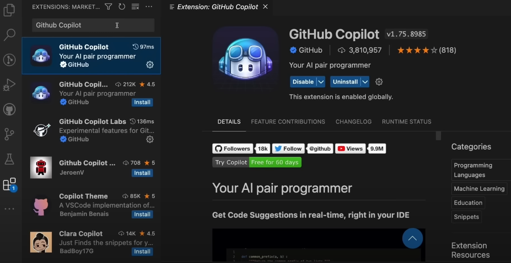

# Setting Up GitHub Copilot

## Step-by-Step Guide

1. Install Visual Studio Code (VSCode).

2. Install the GitHub Copilot extension from the VSCode marketplace.

3. Open VSCode and sign in with your GitHub account.

Alternatively, you can sign in to GitHub in VS Code by selecting the Accounts menu in the Activity Bar, and then Sign in with GitHub to use GitHub Copilot.

Accounts menu in VS Code, showing the option to sign in with GitHub to use GitHub Copilot.

In your browser, GitHub requests the necessary permissions for GitHub Copilot. To approve these permissions, select Authorize Visual Studio Code.

## Validation: Check the Copilot status
Now that you've signed up for GitHub Copilot and activated the extension, let's verify that it's actually active.

1. Open Visual Studio Code.

2. Notice the GitHub Copilot icon in the status bar, which indicates that GitHub Copilot is active.

3. Select the GitHub Copilot icon to open the Copilot status.

The GitHub Copilot status should show Ready.

Screenshot showing the GitHub Copilot status menu in VS Code, indicating that the Copilot status is ready.

## Quick Demo

- Create JavaScript file.
- Start typing a function and observe the suggestions from Copilot.

// q: What does SOLID stand for in OO programming?